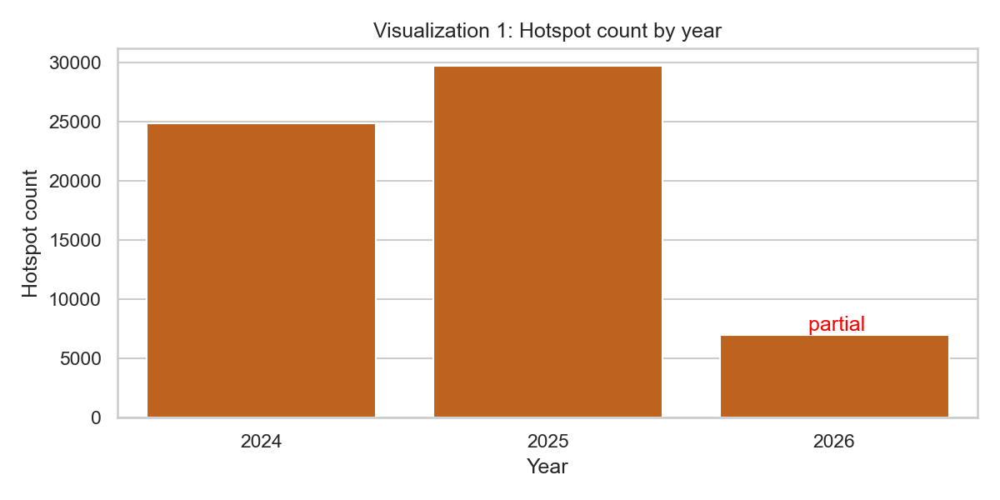
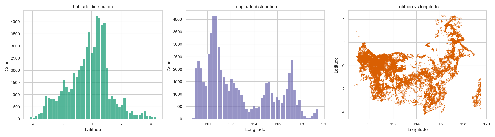
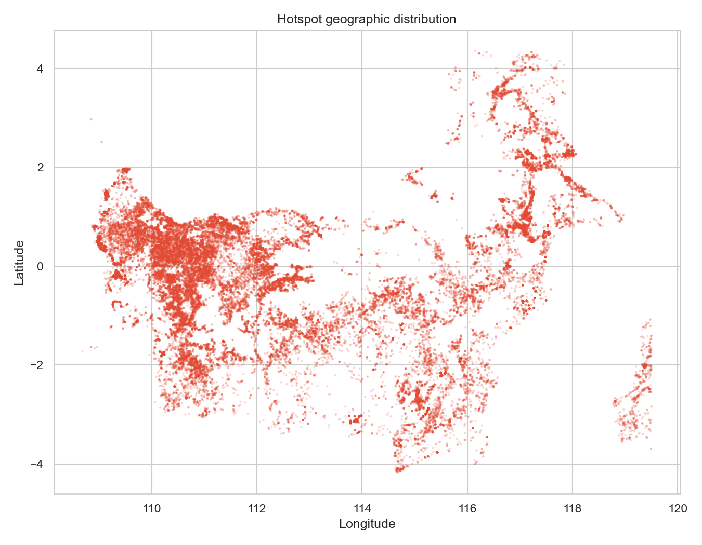
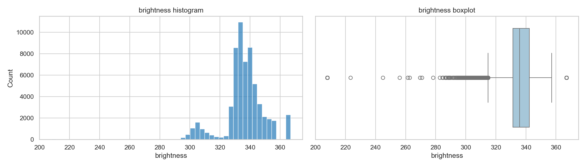
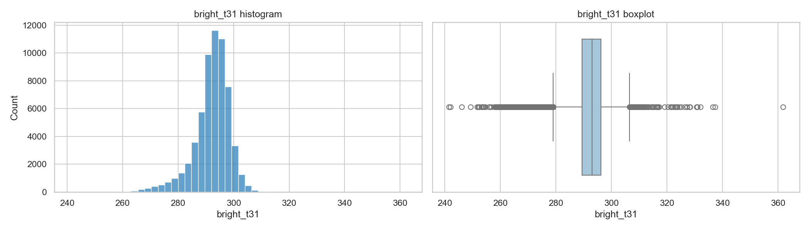
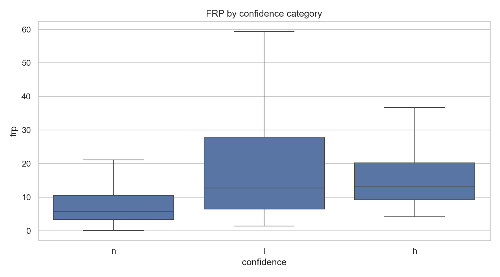

# 🔥 Penjelasan EDA Dataset Hotspot FIRMS Kalimantan

Dokumen ini masih hanya penjelasan hasil eksplorasi data dari `fireline_hotspot_kalimantan_viirs_noaa20_2024_2026.csv`, ditulis per-bagian agar mudah di-scan dan tiap visual ada penjelasan detailnya sendiri(semoga). Analisisnya murni dari dataset utama ini dulu: **belum ada** batas provinsi, data eksternal (kecuali satu pengecualian di 8.4 yang khusus buat validasi, dijelasin di bawah, buang datanya nanti setelah data preprocessing), spatial join, machine learning, atau sistem scoring apapun. Ini masih tahap "kenalan sama data", belum masuk ke cleaning data atau bahkan modeling.

---

## 📦 Ringkasan Dataset

Total ada **61.583 deteksi hotspot** dengan **15 variabel/kolom**. Rentang tanggal aktualnya dari **1 Agustus 2024** sampai **31 Mei 2026**. Kabar baiknya: **nol baris duplikat identik** dan **nol missing value** di semua kolom yang dicek, jadi dari sisi kebersihan struktural, tinggal perlu cleaning dikit, gak perlu imputasi atau dedup tambahan.

Tapi ada satu catatan penting: cakupan waktunya **belum penuh** buat seluruh periode kalender. 2024 baru mulai kecatet dari Agustus (jadi Jan–Jul 2024 kosong bukan berarti gak ada api, tapi emang belum ada datanya), sementara 2026 baru sampai Mei. Konsekuensinya: **jangan pernah** bandingin total 2026 langsung sama total tahun yang udah penuh (2025) — itu bakal salah kaprah karena beda durasi coverage.

---

## 🔍 Kualitas Data & Validasi

Poin-poin hasil pengecekan kualitas:

- **Latitude**: rentang **-4,17349 sampai 4,35095** — semua masih dalam batas global yang valid, nol nilai hilang.
- **Longitude**: rentang **108,6836 sampai 119,49944** — sama, semua valid dan lengkap.
- Secara kasar, footprint koordinat ini emang masuk akal buat cakupan umum Kalimantan — tapi ini **bukan** berarti tiap titik udah dipastiin ada di daratan Kalimantan (itu baru divalidasi lebih detail di bagian 8.4 di bawah, pake geopandas).
- **FRP** (Fire Radiative Power): minimum **0,09**, maksimum **954,79**. Gak ada nilai negatif atau nol. Nilai maksimum yang lumayan ekstrem ini **sengaja dipertahankan**, bukan di-cap/dibuang, karena bisa aja itu emang deteksi api dengan intensitas tinggi beneran, bukan error sensor.
- Ada potensi duplikasi berdasarkan kombinasi koordinat+tanggal+waktu+satelit yang mirip — tapi ini diperlakukan sebagai "pengamatan berulang yang perlu dicek lagi", **bukan** langsung diasumsikan salah/error dan dihapus otomatis.

---

## 📅 Cakupan & Pola Temporal

### Breakdown per tahun

| Tahun | Jumlah Deteksi |
|---|---:|
| 2024 | 24.884 |
| 2025 | 29.735 |
| 2026 | 6.964 |

Bulan dengan total deteksi terbanyak (digabung lintas tahun) adalah **September (25.987)**, disusul Agustus lalu Juli. Yang paling sepi itu **Desember (cuma 339)**. Pola ini nunjukin konsentrasi kuat sekitar **Juli–Oktober** — tapi inget lagi, karena 2024 & 2026 itu tahun parsial, konsistensi pola antar-tahun harus dibaca dengan catatan itu di kepala.

### Visual 1 — Jumlah hotspot per tahun

Bar chart simpel yang nunjukin total mentah per tahun. **Hati-hati baca ini**: 2024 keliatan lebih rendah dari 2025 bukan berarti aktivitas kebakarannya emang lebih rendah — itu karena 2024 cuma kecatet 5 bulan (Agu–Des), sedangkan 2025 kecatet penuh 12 bulan. Bandingin total mentah kayak gini rawan salah interpretasi kalau lupa catatan ini.

### Visual 2 — Tren year-month (over time)

Ini versi time-series-nya, per bulan-tahun (year-month), jadi lebih granular dari bar chart tahunan di atas. Dari sini keliatan jelas ada lonjakan tajam banget di sekitar September 2024, terus pola naik-turun yang berulang tiap tahun mengikuti musim kemarau — bukan tren naik/turun yang linear/konstan.

### Visual 3 — Heatmap cakupan temporal

Heatmap tahun (baris) x bulan (kolom), jadi bisa langsung ketauan bulan mana di tahun mana yang paling "panas" datanya. Sel-sel gelap/terang cuma numpuk di kolom bulan 7–10 (Juli–Oktober), konsisten di 2024 & 2025 — ini bukti visual paling gamblang buat pola musiman ekstrem yang disebut tadi.

### Gap tanggal

Ada beberapa tanggal di dalam rentang observasi yang **gak punya deteksi sama sekali**. Ini penting buat diinget: itu celah di catatan deteksi (mungkin ketutup awan, di luar jam lintas satelit, dll), **bukan** bukti bahwa beneran gak ada kebakaran di tanggal itu. Detail lengkapnya ada di [`temporal_gaps.csv`](outputs/tables/temporal_gaps.csv) dan [`missing_year_months.csv`](outputs/tables/missing_year_months.csv).

---

## 🗺️ Pola Spasial

Bagian ini murni pake latitude & longitude doang buat gambarin sebaran geografis.

### Visual 4 — Distribusi koordinat

Histogram latitude & longitude masing-masing — buat liat apakah sebarannya merata atau numpuk di area tertentu, dan sekaligus ngecek gak ada outlier koordinat yang aneh (misal nyasar ke 0,0 atau angka yang gak masuk akal).

### Visual 5 — Scatter geografis

Scatter plot mentah semua titik (belum di-hexbin), marker dibikin kecil & transparan biar area padat gak numpuk jadi blob solid doang. Ini versi "raw" sebelum masuk ke density plot.

### Visual 6 — Kepadatan spasial (hexbin)

Nah, ini yang lebih kebaca buat liat densitas — area dengan warna lebih terang/pekat itu konsentrasi titik yang lebih tinggi. Tapi penting: konsentrasi ini bisa aja dipengaruhi juga sama pengulangan deteksi (satu lokasi kedetek berkali-kali) dan karakteristik lintasan satelit, jadi **jangan** langsung disamain dengan "total kebakaran" per area atau langsung diasosiasikan ke provinsi tertentu — itu baru dicek resmi di bagian selanjutnya.

### 🧭 Validasi batas wilayah Kalimantan (geopandas)

Cek rentang koordinat di atas cuma mastiin lat/lon-nya masih dalam batas global yang valid — belum tentu titiknya beneran jatuh di daratan Kalimantan. Jadi sebagai pengecekan tambahan (pake file batas provinsi eksternal, **khusus buat validasi ini doang**, gak digabung ke dataframe utama), tiap titik deteksi dicek secara point-in-polygon terhadap boundary Kalimantan — dan sekalian dicek juga terhadap boundary Sulawesi, karena pantai barat Sulawesi lumayan deket sama pantai timur Kalimantan kalau dilihat dari bounding box dataset ini.

Hasilnya:

- **98,44%** titik (60.624 dari 61.583) **beneran** ada di dalam poligon Kalimantan. Solid.
- **1,24%** (765 titik) malah jatuh di dalam poligon **Sulawesi** — kemungkinan ini titik yang salah label "Kalimantan", atau memang area perbatasan yang ambigu secara geometris.
- **0,32%** (194 titik) gak masuk poligon manapun. Tapi dari 194 ini, **172 titik (89%)** cuma berjarak ≤5 km dari garis pantai Kalimantan — kemungkinan besar ini efek garis pantai di file batas yang dipakai emang disederhanakan (simplified), bukan datanya yang salah. Sisanya cuma **10 titik** yang jaraknya >50 km, dan pas dicek koordinatnya, ini pun masih di area yang masuk akal secara geografis (dekat pulau kecil atau perbatasan provinsi lain), bukan koordinat random kayak di tengah laut lepas.

**Kesimpulannya:** klaim "semua data ada di Kalimantan" itu secara umum bener (>98%), tapi ada porsi kecil yang secara geometris lebih deket ke Sulawesi dan layak dicek ulang lagi kalau nanti butuh analisis ketat per-provinsi. Detail per titik ada di [`kalimantan_boundary_outside_points.csv`](outputs/tables/kalimantan_boundary_outside_points.csv), ringkasannya di [`kalimantan_boundary_validation.csv`](outputs/tables/kalimantan_boundary_validation.csv), visualnya di [`kalimantan_boundary_check.png`](outputs/figures/kalimantan_boundary_check.png). Catatan penting: file batas yang dipakai itu data publik yang udah disederhanakan, bukan sumber resmi BIG/GADM — jadi ini sifatnya sanity check aja, bukan pengganti validasi administratif resmi.

### 🔁 Lokasi hotspot yang berulang (persistent)

Deteksi dikelompokin ke sel grid koordinat sekitar 0,05° (kira-kira 5–6 km per sel), terus dihitung berapa bulan-kalender berbeda tiap sel itu "aktif" (ada deteksi). Ini kegunaannya buat bedain lokasi yang cuma kena satu kejadian kebakaran besar sekali doang vs lokasi yang emang kebakaran berulang/kronis.

Sel paling persisten aktif di **20 bulan-tahun berbeda** dengan total **121 deteksi** — pola kayak gini biasanya nunjukin lokasi lahan gambut yang udah terdegradasi (chronic smoldering), bukan satu peristiwa tunggal yang kebetulan gede. Tabel 15 sel teratas ada di [`persistent_hotspot_cells.csv`](outputs/tables/persistent_hotspot_cells.csv).

---

## 🔥 Intensitas Api (FRP, Brightness, Bright_T31)

### Statistik FRP

Mean **10,57**, median **6,14**, standar deviasi **17,42**, P90 **22,11**, P95 **32,91**, P99 **70,20**. Gap yang lumayan gede antara mean & median, ditambah ekor sampe 954,79, itu tanda klasik distribusi **right-skewed** — makanya median & percentile jauh lebih representatif buat gambarin "deteksi tipikal" dibanding mean, yang gampang ketarik sama outlier di ekor.

Brightness: mean **335,87**, median **335,86** — cukup simetris. Bright_T31: mean **292,13**, median **292,99** — juga relatif simetris.

### Visual 7, 8, 9 — Distribusi FRP, Brightness, Bright_T31

Histogram FRP di atas nunjukin secara visual gimana miringnya distribusi ke kanan (mayoritas titik numpuk di FRP rendah, ekor panjang ke nilai tinggi) — konfirmasi kenapa skala log kadang dibutuhin buat analisis FRP ke depannya. Sementara Brightness & Bright_T31 bentuknya jauh lebih mendekati normal/simetris, sesuai sama kedekatan mean-median mereka.

### Hubungan antar variabel termal

Korelasi Pearson: FRP vs Brightness = **0,132**, FRP vs Bright_T31 = **0,193**, Brightness vs Bright_T31 = **0,249** — ketiganya **lemah semua**. Artinya, brightness dan bright_t31 itu **bukan pengganti yang baik** buat FRP kalau butuh variabel intensitas — informasinya gak sepenuhnya tumpang tindih, jadi berpotensi saling melengkapi, bukan duplikat satu sama lain.

➡️ **Implikasi penting:** periode dengan jumlah hotspot lebih banyak **gak otomatis** berarti tingkat keparahan lebih tinggi. Frekuensi deteksi (jumlah titik) dan intensitas (FRP) itu dua hal yang beda dan harus selalu dianalisis terpisah, jangan dicampur jadi satu kesimpulan.

---

## 🎯 Confidence & Day/Night

### Distribusi confidence

| Confidence | Jumlah | Persentase |
|---|---:|---:|
| n (nominal) | 57.315 | 93,07% |
| h (high) | 2.320 | 3,77% |
| l (low) | 1.948 | 3,16% |

Yang menarik: kategori **low** justru punya mean FRP paling tinggi (**28,86**) dan median **12,77** — dibanding nominal yang mean-nya cuma **9,63**, median **5,82**. Ini nunjukin `confidence` itu **gak sesederhana** "makin tinggi confidence, makin kuat FRP-nya" — distribusi antar kategori bisa saling tumpang tindih banget dan gampang kepengaruh sama outlier.

### Visual 10 — Distribusi confidence

Breakdown persentase tiap kategori confidence, termasuk kalau dipecah per siang/malam. Hal menarik yang keliatan di sini: di malam hari, kategori `low confidence` nyaris gak muncul sama sekali — cuma nominal & high yang kedetek. Ini lebih ke soal sensitivitas deteksi VIIRS yang beda siang/malam, bukan bukti aktivitas api malam beneran minim.

### Visual 11 — FRP berdasarkan confidence

Boxplot yang bandingin sebaran FRP tiap kategori confidence. Kotak & whisker kategori `low` justru lebih tinggi/lebar dibanding `nominal` — konsisten sama definisi FIRMS bahwa low confidence di siang hari sering karena kontaminasi *sun glint*, bukan indikator ukuran api yang kecil. Implikasinya: kalau nanti bikin scoring, **jangan** asal drop atau underweight titik low confidence — bisa jadi kebakaran paling intens malah "kesembunyi" di kategori ini.

### Day vs Night

Deteksi siang: **54.988**. Deteksi malam: **6.595**. Mean FRP siang **11,61**, malam **1,89**; median siang **6,83**, malam **1,27**. Perbedaan jumlah deteksi ini **jangan** ditafsirin sebagai "kebakaran malam emang lebih sedikit" — waktu lintasan satelit, pencahayaan, tutupan awan, dan ambang deteksi semuanya bisa mempengaruhi apa yang kecatet.

---

## 🔗 Hubungan Antarfitur

### Visual 12 — Korelasi numerik

Correlation matrix/heatmap buat semua variabel numerik sekaligus. Berguna buat liat cepat variabel mana yang punya hubungan kuat vs lemah — tapi ingat, korelasi cuma nunjukin keterkaitan statistik, **bukan** hubungan sebab-akibat.

### Visual 13 — FRP dan confidence

Versi lain dari visual 11 tadi, fokus khusus buat hubungan FRP-confidence dalam konteks feature relationship analysis (bagian 12 di notebook).

### Visual 14 — FRP siang dan malam

Perbandingan visual distribusi FRP antara siang & malam — melengkapi angka mean/median yang udah disebut di atas.

---

## ✅ Kelayakan Fitur untuk Tahap Berikutnya

| Kategori | Variabel | Catatan |
|---|---|---|
| **Strong candidate** | FRP | Butuh transformasi robust atau berbasis persentil dulu buat jadi fitur intensitas |
| **Potential candidate** | Brightness, Bright_T31 | Perlu dicek dulu redundansinya & hubungan sama target yang jelas |
| **Contextual variable** | Confidence, Day/Night | Lebih cocok buat gambarin kualitas/kondisi observasi, bukan keparahan langsung |
| **Weak candidate** | Scan, Track | Nunggu dibuktiin dulu makna & stabilitasnya terhadap target |
| **Contextual spatial candidate** | Latitude/Longitude | Baru berguna kalau udah diagregasi/diturunin jadi fitur spasial yang tepat |

Belum ada bobot, normalisasi, atau sistem scoring apapun yang dibikin di tahap ini — itu emang di luar scope EDA. Tahap berikutnya idealnya mulai dari: definisi target yang jelas, dokumentasi cakupan temporal, evaluasi bias observasi, sama pengecekan redundansi fitur.

---

## 🏁 Kesimpulan

Overall, dataset ini **layak banget** buat lanjut ke analisis eksploratif berikutnya: gak ada missing value atau duplikasi identik, koordinat dalam batas valid (dan udah divalidasi lebih lanjut pake geopandas — 98%+ beneran di Kalimantan), dan variabel termal punya variasi yang jelas & bermakna.

Keterbatasan utama yang perlu terus diinget: **cakupan temporal masih parsial** (2024 & 2026), distribusi FRP yang **menceng ke kanan**, kemungkinan **bias observasi** (siang vs malam, sun glint di low confidence), serta **belum ada target severity/risk yang terdefinisi** buat scoring ke depannya. Hasil EDA ini jadi fondasi buat seleksi & transformasi fitur, sebelum masuk ke integrasi dataset pendukung dan pembangunan sistem scoring beneran.
