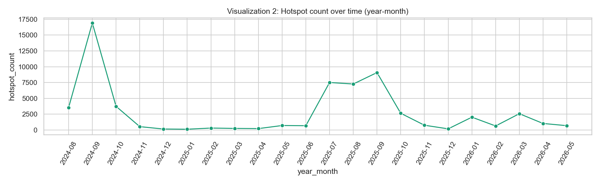
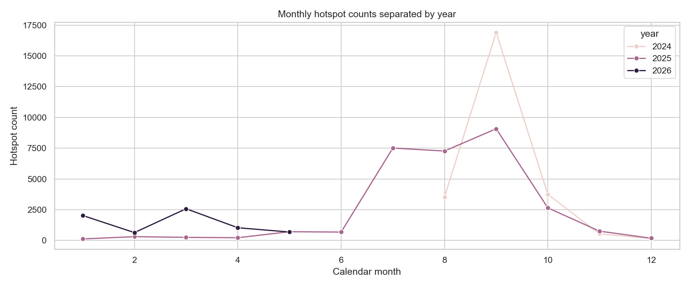
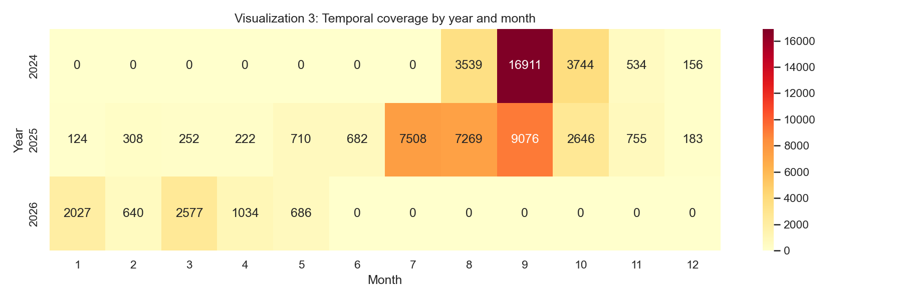
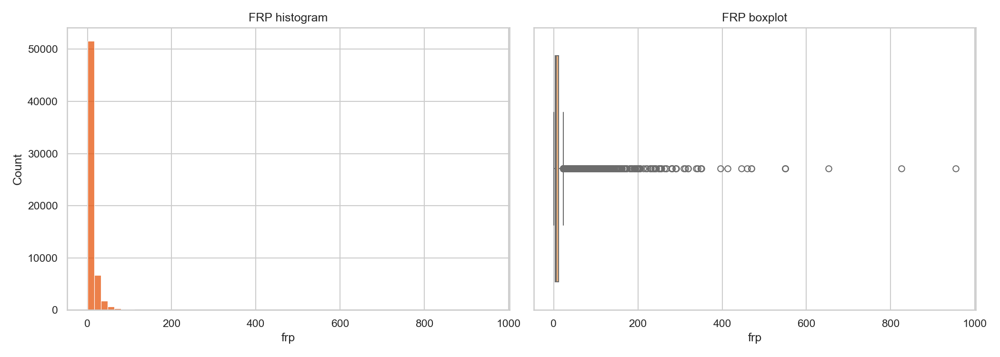
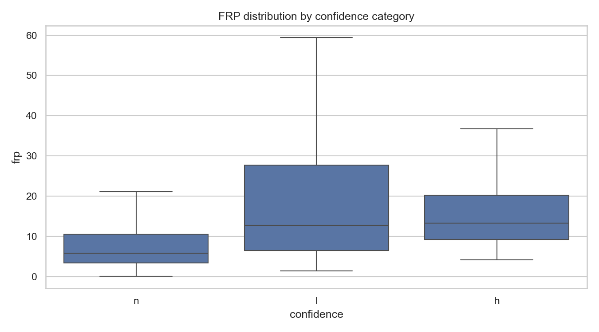
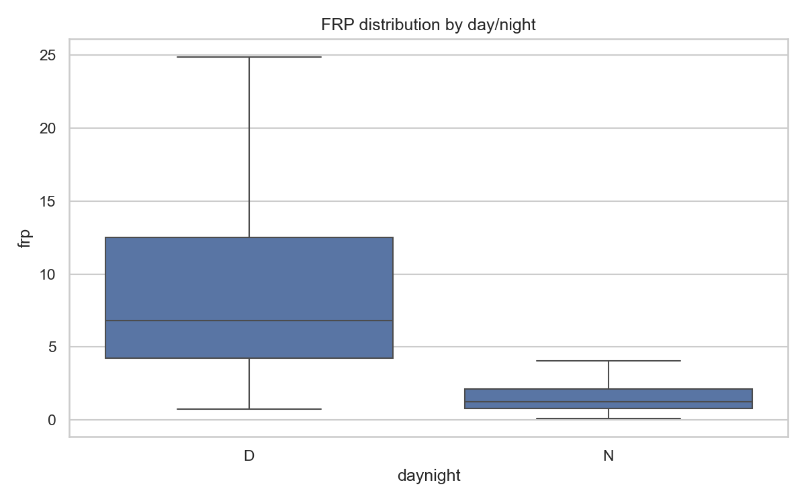
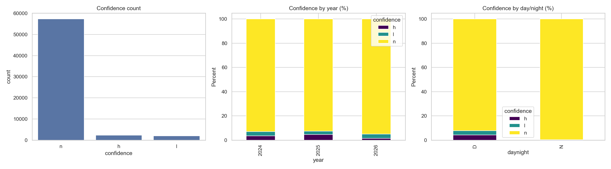
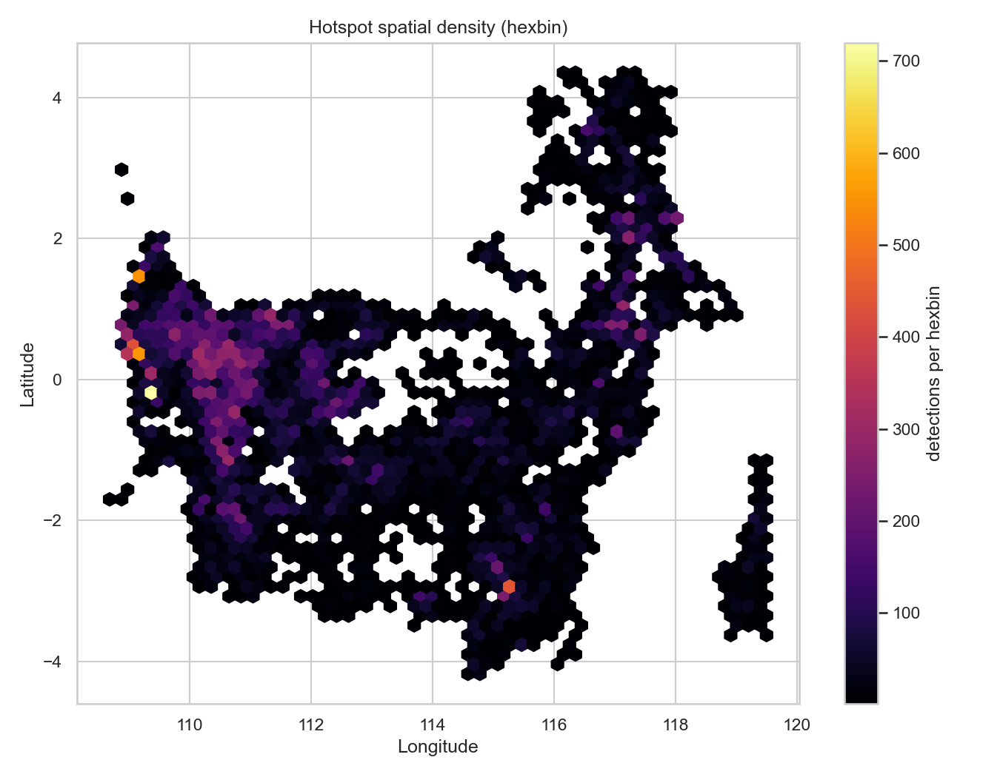
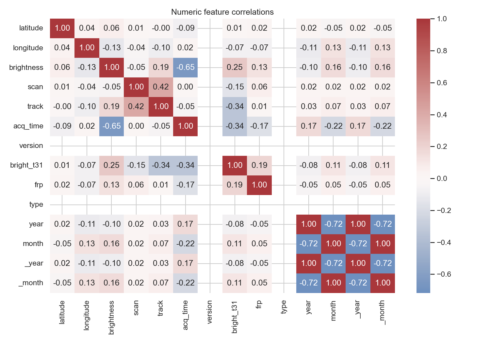
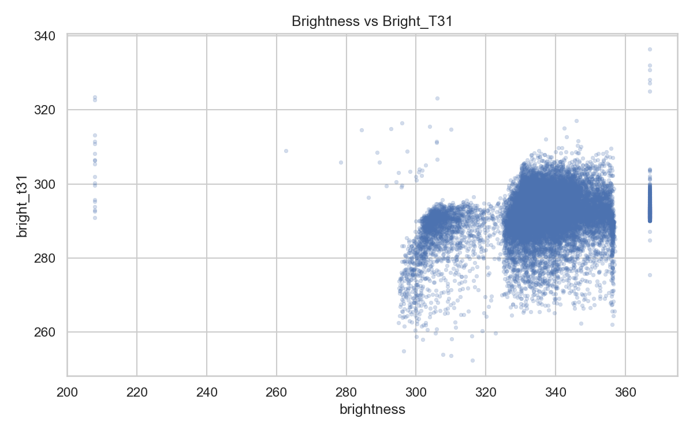

# 🔥 FIRELINE — Laporan EDA Lengkap dengan Bukti Visualisasi

*Dokumen ini merangkum seluruh diskusi, analisis, dan temuan sesi ini — dilengkapi bukti visual langsung dari hasil eksekusi notebook EDA (`EDA_FIRMS_Hotspot_fixed.ipynb`).*

---

## Daftar Isi
1. [Konteks Case](#1-konteks-case)
2. [Dataset yang Dianalisis](#2-dataset-yang-dianalisis)
3. [Bukti Visual & Insight EDA](#3-bukti-visual--insight-eda)
4. [Rekomendasi Dataset Pendukung](#4-rekomendasi-dataset-pendukung)
5. [Review Laporan Tim Lain](#5-review-laporan-tim-lain)
6. [Status & Next Steps](#6-status--next-steps)

---

## 1. Konteks Case

FIRELINE adalah case untuk membangun **decision intelligence platform** karhutla Kalimantan — bukan sekadar peta titik panas. Case brief menekankan 4 pertanyaan inti:

| Pertanyaan | Fokus |
|---|---|
| 🗺️ WHERE | Area mana paling mendesak? |
| 👥 WHO | Populasi/kelompok mana paling rentan? |
| 📢 WHAT TO VERIFY | Laporan/titik mana yang harus diverifikasi dulu? |
| 🚨 WHAT TO DO | Respons apa yang harus diprioritaskan? |

**Prinsip inti:** `Priority = Risk × Exposure × Vulnerability × Urgency` — bukan sekadar `Priority = Fire Size`. Kebakaran kecil dekat permukiman padat bisa lebih prioritas daripada kebakaran besar di lahan kosong.

**Konteks tambahan:** ini case kompetisi dengan deadline → prioritaskan solusi yang selesai dan defensible, bukan maksimal tapi berisiko tidak kelar.

---

## 2. Dataset yang Dianalisis

**File:** `fireline_hotspot_kalimantan_viirs_noaa20_2024_2026.csv`
**Sumber:** NASA FIRMS — sensor VIIRS di satelit NOAA-20

| Metrik | Nilai |
|---|---|
| Total baris | 61.583 |
| Total kolom | 15 |
| Rentang tanggal | 2024-08-01 s.d. 2026-05-31 |
| Baris duplikat | 0 |
| Missing values | 0 |

**Sifat penting dataset:** ini **event-based, bukan laporan harian rutin**. Satu baris = satu deteksi titik panas nyata saat satelit NOAA-20 melintas (1–2×/hari). Tidak ada deteksi di suatu tanggal/lokasi **bukan berarti** "tidak ada api" — bisa jadi tertutup awan atau di luar jam overpass. Dataset juga sudah difilter single-satellite (`N20`), single-instrument (`VIIRS`), dan semua baris berlabel `type=0` (vegetasi).

---

## 3. Bukti Visual & Insight EDA

### 3.1 Kebersihan & Cakupan Data

| Metrik | Nilai |
|---|---|
| Missing values | 0 |
| Koordinat tidak valid | 0 |
| Baris duplikat | 0 |
| Rentang latitude | -4.17 s.d. 4.35 |
| Rentang longitude | 108.68 s.d. 119.50 |

Dataset secara struktural bersih dan siap dipakai tanpa perlu imputasi atau dedup tambahan.

---

### 3.2 Pola Temporal — Musiman Ekstrem

**Insight:** Ada satu lonjakan tajam di September 2024 (~16.900 titik dalam satu bulan) dan lonjakan kedua yang lebih landai di Juli–September 2025. Ini bukan pola acak — ini pola musim kemarau yang berulang.

**Insight:** Saat 3 tahun ditumpuk pada sumbu bulan yang sama, terlihat jelas: **Juli–Oktober** adalah window kritis di setiap tahun yang datanya lengkap (2024, 2025), sementara Januari–Mei relatif rendah — kecuali 2026 yang sudah terlihat lebih tinggi dari pola tahun sebelumnya di bulan yang sama.

**Ini bukti visual paling jelas untuk dua insight sekaligus:**
- **Konsentrasi musiman ekstrem**: sel gelap (nilai tinggi) hanya muncul di kolom bulan 7–10, terutama September 2024 (16.911) dan September 2025 (9.076)
- **Sinyal early-warning 2026**: bandingkan baris 2025 vs 2026 di kolom bulan yang sama —

| Bulan | 2025 | 2026 | Rasio |
|---|---|---|---|
| Januari | 124 | 2.027 | ~16× |
| Maret | 252 | 2.577 | ~10× |

2024 tidak memiliki data Januari–Juli (baru mulai Agustus), jadi perbandingan valid hanya antara 2025 vs 2026 untuk bulan-bulan awal tahun — dan lonjakannya signifikan.

**Tabel breakdown tahunan lengkap:**

| Tahun | Total Titik | Rata-rata Bulanan | Median FRP | Status Cakupan |
|---|---|---|---|---|
| 2024 | 24.884 | 4.976,8 | 6,41 MW | Lengkap Agu–Des |
| 2025 | 29.735 | 2.477,9 | 6,41 MW | Lengkap 12 bulan |
| 2026 | 6.964 | 1.392,8 | 4,38 MW | Parsial (s.d. Mei) |

⚠️ **Catatan metodologi:** Karena 2024 hanya mencakup Agustus–Desember, **total tahunan 2024/2025/2026 tidak bisa dibandingkan langsung** — harus dibandingkan bulan-yang-sama seperti tabel di atas.

---

### 3.3 Distribusi Intensitas Api (FRP)

**Insight:** Distribusi FRP sangat *right-skewed* — mayoritas mutlak titik berkumpul di FRP rendah (<50 MW), tapi ada ekor panjang hingga ~955 MW. Ini konfirmasi kuantitatif kenapa **skala log** diperlukan untuk analisis FRP, dan kenapa **rata-rata (10,57 MW) menyesatkan** dibanding median (6,14 MW) untuk menggambarkan "kebakaran tipikal."

| Statistik FRP | Nilai |
|---|---|
| Minimum | 0,09 MW |
| Median | 6,14 MW |
| Rata-rata | 10,57 MW |
| P95 | 32,91 MW |
| P99 | 70,20 MW |
| Maksimum | 954,79 MW |

---

### 3.4 🎯 Temuan Paling Penting: "Low Confidence" ≠ "Kebakaran Kecil"

**Ini bukti visual paling penting dari seluruh analisis.** Perhatikan boxplot kategori `l` (low confidence) — kotaknya justru **lebih tinggi** dari kategori `n` (nominal), dan whisker atasnya mencapai ~60 MW dibanding `n` yang hanya ~21 MW.

| Confidence | Count | Median FRP | P95 FRP |
|---|---|---|---|
| n (nominal) | 57.315 (93,1%) | 5,82 MW | 30,49 MW |
| h (high) | 2.320 (3,8%) | 13,36 MW | 45,39 MW |
| l (low) | 1.948 (3,2%) | **12,77 MW** | **103,47 MW** |

**Implikasi kritis:** Menurut definisi FIRMS, confidence `low` di siang hari berarti sinyal terkontaminasi *sun glint* — bukan indikator ukuran api. Data mengonfirmasi ini secara empiris: titik `low confidence` justru punya FRP P95 **tertinggi dari semua kategori**, dan nilai FRP maksimum absolut di seluruh dataset (954,79 MW) ada di kategori ini.

➡️ **Untuk Priority Score: jangan pernah drop atau underweight titik `low confidence`** dengan asumsi itu noise — bisa jadi kebakaran paling intens justru "tersembunyi" di sana.

---

### 3.5 Pola Siang vs Malam

| Kondisi | Deteksi | Median FRP | Rata-rata Brightness |
|---|---|---|---|
| Siang (D) | 54.988 (89,3%) | 6,83 MW | 338,98 K |
| Malam (N) | 6.595 (10,7%) | 1,27 MW | 309,92 K |

Panel kanan pada gambar di atas menunjukkan hal menarik: **di malam hari, kategori `low confidence` nyaris tidak muncul sama sekali** (0%) — hanya nominal & high yang terdeteksi. Ini konsisten dengan sensitivitas deteksi VIIRS yang berbeda siang/malam, bukan bukti bahwa aktivitas api di malam hari benar-benar minim.

➡️ **Implikasi:** Jangan asumsikan risiko malam otomatis rendah hanya karena volume deteksi rendah — ini kemungkinan *blind spot* deteksi, sejalan dengan masalah verifikasi lambat di case brief.

---

### 3.6 Peta Sebaran Spasial

**Insight:** Cluster terpadat (warna kuning terang) berada di sekitar longitude ~109, latitude 0–1,5 (wilayah barat, sekitar Kalbar). Ada juga titik cluster terisolasi namun cukup pekat di sekitar longitude ~115,2, latitude -3 (kemungkinan wilayah Kalteng, area yang secara umum dikenal memiliki lahan gambut). Namun secara keseluruhan, kebakaran **tersebar luas di banyak lokasi kecil-menengah**, bukan terpusat di segelintir mega-cluster — bentuk peta ini mengikuti kontur pulau Kalimantan dengan cukup presisi, mengonfirmasi validitas koordinat data.

---

### 3.7 Korelasi Antar Variabel Termal

**Insight:** FRP berkorelasi sangat lemah dengan `brightness` (0,13) dan `bright_t31` (0,19). Brightness sendiri juga hanya berkorelasi 0,25 dengan bright_t31.

Scatter plot ini menunjukkan sebaran yang cukup "berawan"/noisy, mengonfirmasi lemahnya korelasi linear — meski ada pola kasar bahwa brightness tinggi cenderung diikuti bright_t31 yang juga lebih tinggi.

➡️ **Implikasi:** Brightness dan bright_t31 **bukan pengganti FRP yang baik** dalam formula skoring — FRP tetap harus jadi variabel intensitas utama, bukan disubstitusi variabel termal lain.

---

## 4. Rekomendasi Dataset Pendukung

Berdasarkan seluruh bukti di atas, evaluasi terhadap kandidat dataset pendukung:

| Dataset | Rekomendasi | Alasan |
|---|---|---|
| **BPS Population (provinsi)** | ✅ Layak pakai | Granularitas kasar (5 nilai untuk 5 provinsi), tapi cukup untuk case dengan deadline; perlu disebut sebagai limitasi eksplisit |
| **Pontianak Daily Weather 2021–2024** | ❌ Sebaiknya di-drop | Overlap temporal minim (cuma sebagian 2024), kemungkinan cakupan cuma 1 kota (Kalbar) padahal cluster besar juga ada di Kalteng/Kaltim |
| **BMKG Weather** | ⚠️ Perlu dicek dulu | Cek dulu cakupan spasial/temporal sebelum diputuskan; fallback sama seperti Pontianak jika ternyata terbatas juga |

**Rekomendasi alternatif untuk komponen "Urgency":** gunakan proxy **self-referential** dari data hotspot itu sendiri — misalnya jumlah hari berturut-turut ada deteksi di grid/provinsi yang sama sebagai proxy dryness/momentum, memanfaatkan pola musiman yang sudah terbukti kuat dan konsisten (bagian 4.2) — tanpa perlu join data cuaca eksternal yang mismatch temporal/spasial.

---

## 5. Review Laporan Tim Lain

Tim lain telah menyusun pipeline lebih lengkap (4 notebook: audit data → feature engineering → EDA → composite risk index), memanfaatkan dataset tambahan: population+provinsi, climate data 2010–2020, Pontianak weather, **lokasi sekolah** sebagai proxy exposure, dan station BMKG.

### ✅ Poin kuat yang layak dipertahankan
- **Jarak ke sekolah sebagai proxy exposure** — cerdas: proxy kepadatan permukiman + kelompok rentan (anak-anak) + dampak terukur (penutupan sekolah), tanpa butuh data populasi granular
- BallTree + Haversine untuk nearest-neighbor — pilihan teknis tepat untuk skala data ini
- `frp_tier` berbasis kuartil untuk komunikasi yang lebih mudah dipahami
- Distinction volume vs intensitas per provinsi (Kalbar = jumlah terbanyak, Kalteng = FRP paling ekstrem) — sejalan dengan prinsip "Priority ≠ Fire Size"
- Limitasi sudah disebutkan eksplisit di bagian akhir laporan mereka

### 🚩 Masalah yang perlu diklarifikasi/direvisi

1. **Angka tidak cocok** — laporan tim lain menyebut 57.785 titik valid setelah filter, sementara file CSV kita punya 61.583 baris yang semuanya sudah lolos kriteria filter yang mereka sebutkan (semua `type=0`, semua koordinat dalam bounding box mereka). Selisih 3.798 baris ini perlu diklarifikasi langsung — kemungkinan mereka memakai versi file yang berbeda.
2. **Klaim "kebakaran malam = sinyal gambut" overclaim** — pola FRP rendah + persisten di malam konsisten dengan smoldering peat fire, tapi belum terverifikasi dengan peta gambut (yang mereka sendiri akui belum diintegrasikan di bagian limitasi).
3. **Date-shifting 14 tahun untuk data iklim** (2010–2020 digeser ke 2024–2026) — metodologi rapuh untuk klaim sekuat "fondasi ilmiah sistem prediktif", terutama karena pola iklim tahun-ke-tahun sangat dipengaruhi El Niño/La Niña.
4. **Distribusi skor kurang diskriminatif** — kategori Kritis+Tinggi mencapai 72,3% dari total titik, hampir bertentangan dengan tujuan inti "bukan semua titik itu prioritas". Kemungkinan efek pengganda musim 1,5× yang diterapkan blanket ke 84% data yang memang jatuh di musim kemarau.
5. **Bobot formula (60:40, pengganda populasi 0,8–1,2×, musim 1,5×)** disajikan sebagai final padahal ini asumsi awal — perlu sensitivity test agar defensible di depan juri.
6. **Confidence "low" berpotensi diturunkan bobotnya** di `verification_priority` — bertentangan langsung dengan temuan kita di bagian 4.4: FRP tertinggi justru sering ada di kategori low confidence.

---

## 6. Status & Next Steps

- [ ] Klarifikasi ke tim lain soal selisih jumlah baris (57.785 vs 61.583)
- [ ] Putuskan final soal dataset pendukung: BPS population + sekolah (dari tim lain) + skip/replace weather data eksternal
- [ ] Reproduce atau audit ulang composite risk score dari tim lain menggunakan bukti di atas
- [ ] Bangun dashboard (Power BI/Tableau/Looker — tool belum final)
- [ ] Susun draft insight/problem-statement write-up versi gabungan final

---

## Lampiran: Daftar Figure

Semua gambar di bawah adalah output asli notebook (folder `./`), disediakan sebagai bukti pendukung tambahan di luar yang sudah dibahas di atas:

| File | Isi |
|---|---|
| `hotspot_count_by_year.png` | Perbandingan total tahunan (perlu dibaca dengan catatan cakupan parsial) |
| `coordinate_distributions.png` | Sebaran histogram latitude & longitude |
| `geographic_scatter.png` | Scatter plot mentah semua titik (versi non-hexbin) |
| `brightness_distribution.png`, `bright_t31_distribution.png` | Distribusi variabel termal individual |
| `brightness_by_confidence.png`, `bright_t31_by_confidence.png` | Breakdown termal per kategori confidence |
| `scan_distribution.png`, `track_distribution.png` | Distribusi geometri pixel satelit |
| `confidence_distribution.png` | Versi tunggal dari panel pertama gambar bagian 4.5 |
